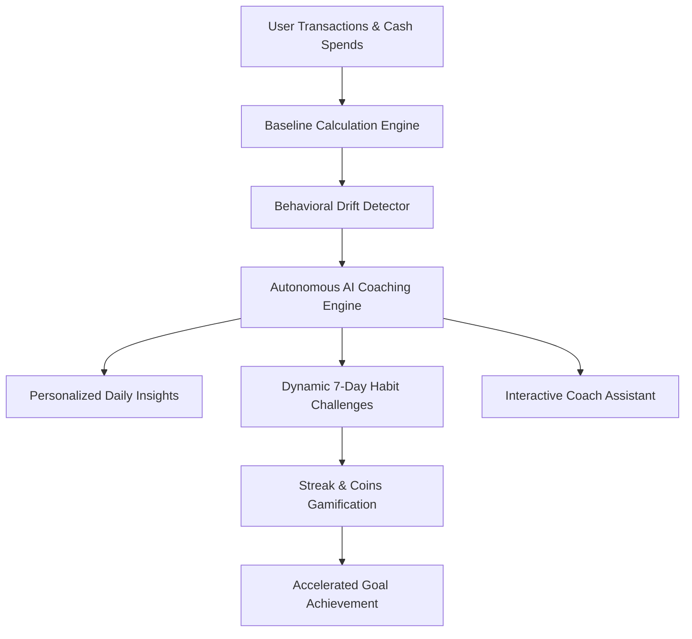

# 📋 DhanMitra (धनमित्र) — Project Pitch & Architectural Overview

## 🎯 Executive Summary
**DhanMitra** is an AI-driven personal financial coach engineered around the psychological principle of **"YOU VS YOU"**. Rather than judging users with arbitrary benchmarks or generic textbook budgets, DhanMitra learns each individual’s 90-day spending baseline, pinpoints behavioral drift in discretionary spending, and converts actionable anomalies into gamified 7-day micro-challenges.

---

## 🔍 The Problem & Market Opportunity
1. **The Budgeting Paradox**: 82% of young adults abandon traditional budgeting apps within 14 days because rigid category caps feel restrictive and punitive.
2. **Context-Blind Advice**: Population averages fail because an engineer in Bengaluru ordering late-night food has completely different behavioral triggers than a college student in Pune.
3. **The Micro-Leak Epidemic**: Impulse UPI transactions (₹150–₹450 on quick commerce and food delivery) accumulate invisibly, eroding month-end savings without noticeable warnings.

---

## 💡 The DhanMitra Solution

### 1. Baseline Behavioral Science
- Calculates rolling 90-day personal benchmarks across categories.
- Measures **Velocity & Drift**: flags deviation percentages rather than arbitrary rupee limits.

### 2. Conversational Financial Coach
- Built-in contextual AI coach answering natural queries (*"Can I afford this?"*, *"How do I cut weekend drift?"*).
- Directly injects user savings rate, goal deadlines, and streak status into coaching reasoning.

### 3. Micro-Habit Compounding
- Replaces intimidating annual budgets with bite-sized **7-day habit challenges** (e.g. *"The 15-Minute Pause"*, *"Midweek Zero-Discretionary"*).
- Every completed habit earns **DhanMitra Coins**, boosts the **Day Streak**, and directs real money toward primary goals.

### 4. Dynamic Goal Forecasting
- Real-time sliders dynamically calculate how small behavioral adjustments accelerate goal completion by weeks or months.

---

## 🏗️ Technical Architecture

### Key Technical Pillars:
- **Offline-First & Autonomous**: Operates with zero external network dependency, ensuring 100% uptime and blazing fast interactions.
- **LocalStorage State Persistence**: Seamlessly retains custom goals, daily check-in logs, and reward balances across browser sessions.
- **Vercel Edge Ready**: Includes `vercel.json` rewrite routing for immediate one-click global deployment.

---

## 🏆 Hackathon Evaluation Checklist

| Criteria | Implementation in DhanMitra |
|---|---|
| **Innovation & Concept** | Novel "YOU VS YOU" baseline approach vs generic textbook budgeting. |
| **User Experience & UI** | Premium fintech aesthetic (Forest Green & Fresh Lime) with Recharts visualizations and confetti rewards. |
| **Completeness** | Full end-to-end flow: Login screen, Baseline charts, Drift donut, AI coach chat, 7-day challenges, and Goal simulator. |
| **Scalability** | Modular React architecture ready for Plaid/Setu Account Aggregator and cloud backend integration. |

---

## 🗺️ Roadmap & Future Vision
- **Account Aggregator (AA) Integration**: Real-time RBI-regulated banking sync via Sahamati / Setu UPI framework.
- **Voice-First Regional Coach**: Support for Hindi, Marathi, Tamil, and Kannada voice prompts.
- **Smart Automated Micro-Investments**: Auto-sweep compound savings into digital gold or liquid mutual funds upon challenge completion.
